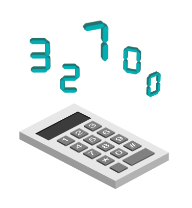
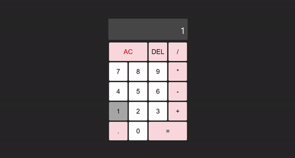

# Calculator using React
[🔗 Visit Site!!](https://anishhh20.github.io/calculator/)

   

Build this site from basic of React n used CSS for style.
  

 

<h2>👀 Demo</h2>

<h2>📬 Contact</h2>

If you want to contact me, you can reach me through below social handles.

<a href="mailto:anishteli238@gmail.com">

